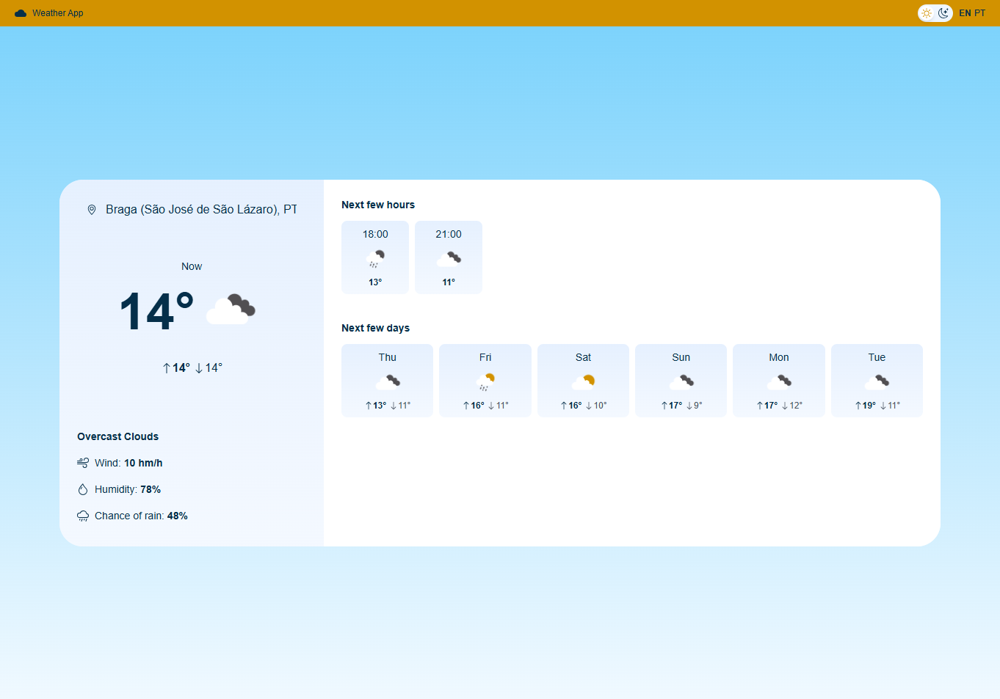
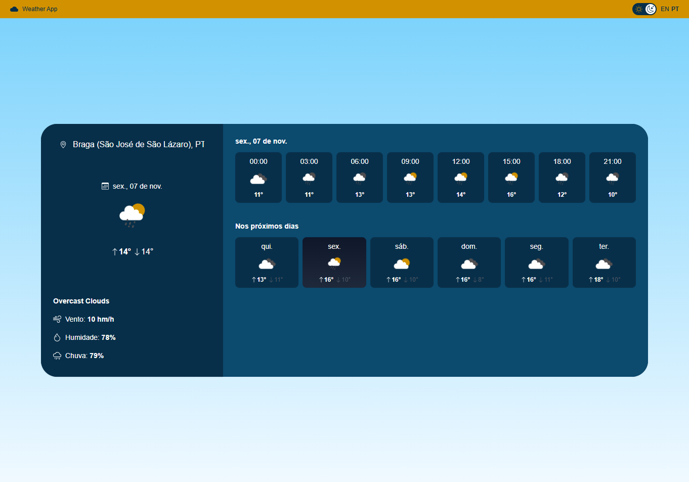
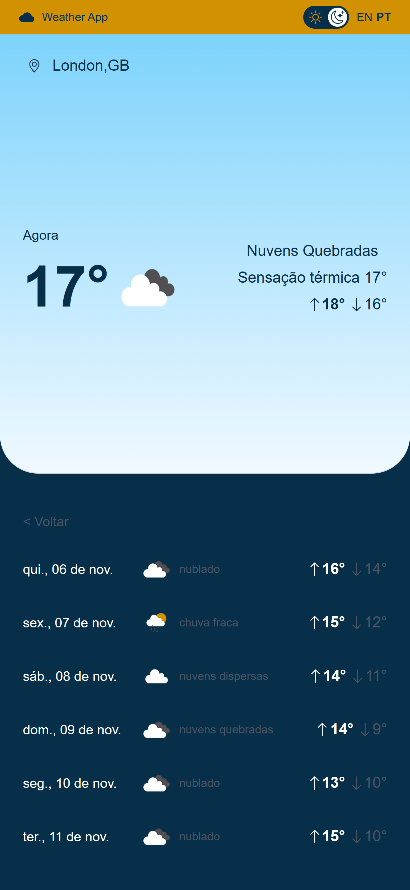

# 🌦️ Weather App

Uma aplicação web simples e responsiva desenvolvida com **React** e **TailwindCSS**, que permite consultar as condições meteorológicas atuais de qualquer cidade, consumindo a **OpenWeather API**.

---

## 🚀 Tecnologias utilizadas

- ⚛️ **React** – criação da interface e componentes reutilizáveis  
- 💨 **TailwindCSS** – estilização rápida e responsiva  
- 🌐 **OpenWeather API** – API com dados meteorológicos (temperatura, humidade, vento)  
- 🔄 **Fetch API / Axios** – consumo de dados REST  
- 🧠 **Hooks (useState, useEffect)** – gestão de estado e ciclo de vida  

---

## 🧩 Funcionalidades

- Pesquisa de cidades para obter dados meteorológicos em tempo real 
- Pesquisa com base na localização atual
- Exibição de:
  - Nome da cidade e país  
  - Temperatura atual e descrição do clima  
  - Temperaturas máximas e mínimas
  - Ícone correspondente à condição meteorológica  
  - Humidade, velocidade do vento e probabilidade de chuva
  - Previsão diária e nos 7 dias seguintes
- **Modo escuro/claro**, com preferência guardada localmente  
- **Suporte multilíngua (PT/EN)** 
- Layout **totalmente responsivo** (desktop, tablet, mobile)  
- Mensagem de erro caso a cidade não seja encontrada 

---

## 🖼️ Demonstração

🔗 **Versão online:** [Weather App](https://weather-app-three-plum-95.vercel.app/)

  
  
 
 

---

## ⚙️ Como executar localmente

```bash
npm install
npm start
npm run build
